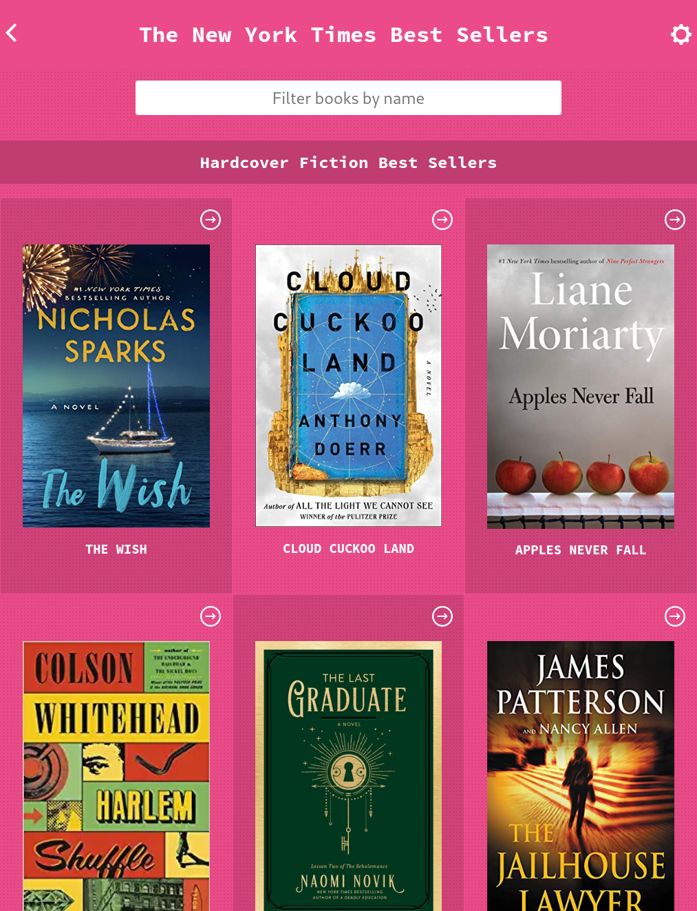

# New York Times Best Sellers Catalog
This simple react-redux app fetches this month's NY Times bestseller list and lets you filter it by name.
You can also click on books and see the details about the book.



## Built With

- ReactJS
- Javascript
- Redux
- Redux Toolkit

## Getting Started

In order to run this app on your local environment:

- Clone the project on your local machine with the following command.

```bash 
git clone git@github.com:sinansevgi/best-sellers-catalog.git
```

- Navigate to the project directory
- Run following command to install dependencies
```bash 
npm install 
```

- **In order to use this application you need to have NY Times books API key. Please follow below instructions to get an api key**
> - Create NY Times Developer account from [this link](https://developer.nytimes.com/accounts/create).
> - Login to your account.
> - Select My Apps from the user drop-down.
> - Click + New App to create a new app.
> - Enter a name and description for the app in the New App dialog.
> - Click Create.
> - Click the APIs tab.
> - Click the access toggle to enable or disable access to th Book API from the app.
> - View the API key on the App Details tab.
> - Confirm that the status of the API key is Approved.

- Once you get your api key create file name `.env` in project root folder.
```bash
touch .env
```
- Paste below statement with your api key placed in specified location.
```
REACT_APP_ACCESS_TOKEN='REPLACE_WITH_YOUR_API_KEY'
```

- You can run the app with the following command.
```bash 
npm run start
```


This project was bootstrapped with [Create React App](https://github.com/facebook/create-react-app).

## Live Demo Link

You can use [this link](https://agitated-pare-3b3254.netlify.app/) to access the demo version of this app.

## Authors

👤 **Sinan Sevgi**

- GitHub: [@sinansevgi](https://github.com/sinansevgi)
- LinkedIn: [@sinansevgi](https://www.linkedin.com/in/sinansevgi/)
- Portfolio: [Website](https://sinansevgi.com)


## 🤝 Contributing

Contributions, issues, and feature requests are welcome!

Feel free to check the [issues page](../../issues/).

## Show your support

Give a ⭐️ if you like this project!

## Acknowledgments
- Book covers taken from the [Open Library cover API](https://openlibrary.org/dev/docs/api/covers)
- Best Seller list fetched from the [New York Times Book API](https://developer.nytimes.com/docs/books-product/1/overview)
- Design idea by [Nelson Sakwa on Behance](https://www.behance.net/gallery/31579789/Ballhead-App-(Free-PSDs))

## 📝 License

This project is [MIT](./LICENSE) licensed.
